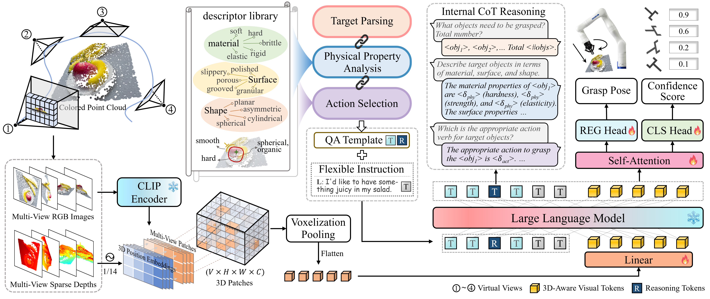

<div align="center">
<h1>GraspCoT: Integrating Physical Property Reasoning for 6-DoF Grasping under Flexible Language Instructions <br> (ICCV 2025)</h1>


Xiaomeng Chu, Jiajun Deng, Guoliang You, Wei Liu, Xingchen Li, Jianmin Ji, Yanyong Zhang

<a href="https://arxiv.org/abs/2503.16013"></a>
<a href="https://drive.google.com/file/d/10aKwwtetNYHsreK09wn0MsBeQfvA3qsw/view?usp=sharing" target="_blank"></a>

</div>

```bibtex
@article{chu2025graspcot,
  title={GraspCoT: Integrating Physical Property Reasoning for 6-DoF Grasping under Flexible Language Instructions},
  author={Chu, Xiaomeng and Deng, Jiajun and You, Guoliang and Liu, Wei and Li, Xingchen and Ji, Jianmin and Zhang, Yanyong},
  journal={arXiv preprint arXiv:2503.16013},
  year={2025}
}
```

## Overview

This repository is an official implementation of [GraspCOT](https://arxiv.org/abs/2503.16013), an innovative 6-DoF grasp detection framework that integrates a Chain-of-Thought (CoT) reasoning mechanism oriented to physical properties, guided by auxiliary question-answering (QA) tasks.

<div style="text-align: center;">
    
</div>

## Environment

We test our codes under the following environment:

* Python 3.10
* Pytorch 2.1.0
* CUDA Version 11.8

1. Clone this repository.
   
   ```
   git clone https://github.com/cxmomo/GraspCoT.git
   cd GraspCoT
   ```
2. Install packages.
   
   ```
   conda create -n graspcot python=3.10 -y
   conda activate graspcot 
   pip install torch==2.1.0 torchvision==0.16.0 torchaudio==2.1.0 --index-url https://download.pytorch.org/whl/cu118
   pip install torch-scatter -f https://data.pyg.org/whl/torch-2.1.0+cu118.html
   pip install flash-attn --no-build-isolation
   pip install -e .
   ```
3. Install other dependencies:
   
   ```
   pip install openmim
   mim install mmengine==0.10.5
   mim install mmcv==2.1.0
   mim install mmdet==3.2.0
   pip install numpy==1.26.4
   conda install -c fvcore -c iopath -c conda-forge fvcore iopath
   conda install pytorch3d -c pytorch3d
   ```


## Prepare Dataset

1. Make data folder.
   ```
   cd GraspCOT
   mkdir data
   ```
2. Download nuScenes from [Grasp-Anything-6D](https://huggingface.co/datasets/airvlab/Grasp-Anything-6D), follow their usage instructions, and put it in `data/grasp_anything`.
3. Download the revised scenario description file with bugs fixed from [Google Drive](https://drive.google.com/file/d/1hpDD6PSA9l4vqDmtyUfM9rqzHpK9aQs-/view?usp=sharing), unzip, and put it in `data/grasp_anything`.
4. Download the generated flexible instruction info files of [train](https://drive.google.com/file/d/1VLga3xvwh5qyUNNyb73odzxDvSttCMiA/view?usp=sharing) and [val](https://drive.google.com/file/d/17Ri0tnFqir023IIvWpT-AeC1RuqvBR68/view?usp=sharing) sets, and put it in `data/grasp_anything/dialogues`.
5. Generate the projected images, depth maps, and a series of grasping info files from colored point cloud.
   ```
   bash scripts/create_grasp_data.sh
   ```
6. Folder structure:

```
data/grasp_anything
├── depth
├── dialogues
├── pc
├── rgb
├── scene_description
├── grasp_anything_infos_train_0.pkl
├── ...
├── grasp_anything_infos_train_7.pkl
├── grasp_anything_infos_val_0.pkl
├── grasp_anything_infos_val_1.pkl
```

## Training

1. Make a folder for pretrained LLM models.
   
   ```
   mkdir pretrained_llms
   ```
2. Download [pretrained LLaVA-3D-7B](https://huggingface.co/ChaimZhu/LLaVA-3D-7B) and [pretrained CLIP](https://huggingface.co/openai/clip-vit-large-patch14-336) put it in directory `pretrained_llms/`:

```
pretrained_llms
├── llava-3d-7b
   ├── config.json
   ├── ...
   ├── model-00001-of-00003.safetensors
   ├── ...
├── clip-vit-large-patch14-336
   ├── config.json
   ├── ...
```

3. Train GraspCoT with 8 NVIDIA RTX 3090 GPUs:

```
bash scripts/train/dist_train.sh
```

## Evaluation

1. Make a folder for trained model weights.
   
   ```
   mkdir checkpoints
   ```
2. Download the [model weights](https://drive.google.com/file/d/10aKwwtetNYHsreK09wn0MsBeQfvA3qsw/view?usp=sharing) and put it in directory `checkpoints/llava-graspcot`.
3. Generate the predicted 6-DoF grasp poses and perform evaluation.
   
   ```
   cd checkpoints/llava-graspcot
   ln -s ../../pretrained_llms/llava-3d-7b/* ./
   python llava/eval/generate_scene_grasp.py --model-path checkpoints/llava_graspcot/ --model-base pretrained_llms/llava-3d-7b/ --data-path data/grasp_anything --output_dir checkpoints/llava_graspcot/
   python scripts/eval/eval_scene_grasp.py --data checkpoints/llava-graspcot/scenegrasp_gen_data.pkl
   ```


## Acknowledgements

Many thanks to these excellent open-source projects:

* Codebase: [LLaVA-3D](https://github.com/ZCMax/LLaVA-3D), [MMDetection](https://github.com/open-mmlab/mmdetection), [MMCV](https://github.com/open-mmlab/mmcv)
* Data: [Grasp-Anything-6D](https://airvlab.github.io/grasp-anything/docs/grasp-anything-6d/)
